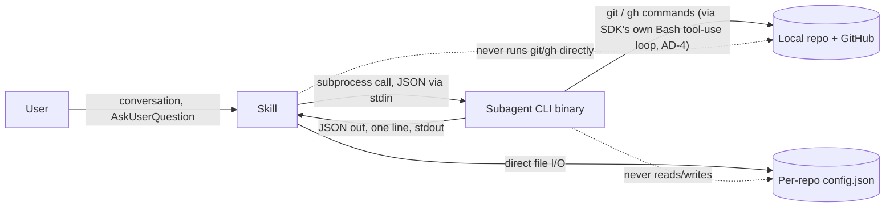

# Architecture Spine — Git-Agent

## Design Paradigm

**Orchestrator/Worker.**

- **Orchestrator = the 6 Claude Code skills**, each running natively inside the user's interactive Claude Code session. Skills hold *all* conversation, *all* user interaction (`AskUserQuestion`), and *all* state that spans multiple subagent calls (e.g. holding a commit plan while the user makes decisions about it).
- **Worker = one shared subagent**, a standalone program built on the Claude Agent SDK, invoked fresh per action as a subprocess. It is stateless between invocations, owns no conversation, and carries its own tool access and safety policy in its own code.
- Directory mapping: `skills/<skill-name>/` (Claude Code skill definitions) ↔ `subagent/src/actions/<action>.ts` (one handler per subcommand) ↔ `subagent/src/hooks/` (the in-process policy shared by every action).

## Invariants & Rules

### AD-1 — Subagent calls are one-shot and stateless; all user interaction happens in the orchestrating skill

- **Binds:** FR-1, FR-3, FR-4, FR-9 (all flows with mid-flow user interaction), and the skill↔subagent contract generally.
- **Prevents:** the skill absorbing git-domain logic (parsing or editing a plan's internals) or the subagent attempting to hold a conversation it structurally cannot (no `AskUserQuestion` access; a subprocess call runs to completion and returns once).
- **Rule:** A subagent invocation never spans a user decision. Any flow needing a user decision mid-way is split into ≥2 subagent calls: an earlier call returns a self-contained proposal/result; the skill performs all `AskUserQuestion` interaction; a later call receives the *original result plus the user's raw decisions* as plain input — never a plan object the skill parsed or mutated itself.

### AD-2 — The subagent is a standalone Claude Agent SDK program, not a declarative Claude Code subagent

- **Binds:** all FRs; especially FR-6.
- **Prevents:** the no-force-push guarantee depending on Claude Code's `settings.json`/`settings.local.json` hook system, which is global to a whole Claude Code session (any skill, any unrelated prompt) and cannot be scoped to just this program's own actions.
- **Rule:** The subagent is real TypeScript code that calls the Claude Agent SDK's `query()`/`ClaudeSDKClient` itself, launched by a skill as a subprocess (via the skill's `Bash` tool). It is never a `.claude/agents/*.md` definition invoked via the `Task` tool.

### AD-3 — The no-force-push guarantee is an in-process SDK hook, not a Claude Code hook

- **Binds:** FR-6, and the Cross-Cutting NFR "Never force push."
- **Prevents:** force-push protection leaking into scope it shouldn't cover (any Claude Code session in the repo, any skill, the user's own terminal) or depending on repo-committed or personal Claude Code settings files.
- **Rule:** The subagent registers a `PreToolUse` hook via `options.hooks` in its own `query()`/`ClaudeSDKClient` call, on the `Bash` matcher. The hook is **deny-by-default for anything push-shaped**: it parses the command's argument tokens (not a single regex over the raw string) and denies unless the invocation is a recognized plain `git push` (or `gh` push-equivalent) with no force-indicating token in any position — covering long form (`--force`), short form (`-f`), value-attached (`--force-with-lease=<ref>`), and combined short flags (`-uf`). Any command it doesn't recognize as a safe plain push (an alias, a wrapper script, an unrecognized flag combination) is denied, not allowed through. This hook exists only inside the subagent's own SDK session — it is never written to `settings.json` or `settings.local.json`, never affects the user's manual terminal use, and never affects any Claude Code session other than this subagent's own.

### AD-4 — Every git-mutating subagent action must execute git through the SDK's own agentic tool-use loop, never a bypassing direct process call

- **Binds:** FR-6, and by extension every action that touches the repository (push, execute-commit, create-branch, merge, finish-merge).
- **Prevents:** AD-3's hook silently protecting nothing — if an action is implemented as a plain `child_process.exec("git push")` outside `query()`'s own tool-use loop, the `PreToolUse` hook never fires, because it's a `query()` mechanism, not a shell-level guard.
- **Rule:** Any subagent action that runs a git or `gh` command that could mutate remote or local repo state MUST issue that command as a `Bash` tool call inside the same `query()`/`ClaudeSDKClient` invocation that registered the `options.hooks` from AD-3. No action may shell out to git via a direct process-spawn that bypasses the SDK's tool-execution path. This is the enabling condition for AD-3 — without it, AD-3's Rule is unenforceable.

### AD-5 — One subagent binary, subcommand-routed

- **Binds:** all skill↔subagent invocation; FR-6 (single place the hook lives).
- **Prevents:** duplicated SDK/hook wiring across per-flow binaries drifting out of sync.
- **Rule:** The subagent ships as a single `package.json` `bin` entry (e.g. `git-agent-subagent`). Internally it routes on its first argument (the action name) to one handler per action, the way `git` itself is one binary with subcommands. New actions are added as new routed handlers, never as new binaries.

### AD-6 — Skill↔subagent call count follows whether a plan needs approval before acting

- **Binds:** FR-1 through FR-9.
- **Prevents:** every flow inventing its own ad hoc number of round-trips.
- **Rule:**
  | Flow | Calls | Shape |
  | --- | --- | --- |
  | create-branch | 1 | `create-branch` — no plan to approve; type/task/description already resolved in skill conversation |
  | commit | 2 | `plan-commit` → user decisions (relayed raw, unedited) → `execute-commit` |
  | push | 1 | `push` — hook-enforced, never force |
  | create-pr | 2 | `draft-pr` → user edits → `create-pr` |
  | update-branch | 1 or 2 | `merge` (clean = done; conflict = report + hand off to user) → `finish-merge` (only if conflicted) |
  | configure | 0 | direct file I/O in the skill; no subagent call |

### AD-7 — Branch-parent tracking does not exist; create-PR's target always defaults to config, user can override

- **Binds:** FR-8. Resolves PRD Open Question 2.
- **Prevents:** a parent-tracking storage mechanism (git config, state file, or derivation heuristic) whose failure modes (staleness on rename/delete, orphaned entries) outweigh its payoff.
- **Rule:** `draft-pr`/`create-pr` never attempt to detect a branch's parent. The target branch is always the config file's `defaultPrTarget`, shown to the user for confirmation or override before `create-pr` runs.

### AD-8 — Config file is read/written directly by skills; the subagent never touches it

- **Binds:** FR-10, FR-11.
- **Prevents:** scope creep of "the subagent does all filesystem/git work" into plain config I/O, which isn't git/GitHub work.
- **Rule:** Any skill needing config values (task/branch types, default PR target) reads the config JSON file directly. The `configure` skill writes it directly. The subagent has no config-reading code path.

### AD-9 — Commit plan schema is fixed; local-only detection lives in `plan-commit`, not the skill; local-only candidates are part of a successful plan, not a stop

- **Binds:** FR-3, FR-4.
- **Prevents:** a subagent-builder and a skill-builder independently inventing incompatible shapes for "the plan" and "the user's decisions" (e.g. commits keyed by index vs. by message; local-only decisions mixed into a generic decision list vs. their own map) — `execute-commit` would then be unable to parse what the skill sends back. Also prevents the PRD-text/spine mismatch where FR-4 reads as "the skill identifies" local-only files while AD-8 forbids skills from touching the repo directly.
- **Rule:**
  - `plan-commit` (subagent) is the sole owner of local-only-file detection, using a fixed, extensible filename-pattern heuristic (SEED, grows over time): `.env`, `.env.*`, `*.pem`, `*.key`, `credentials*`, `secrets*`, `*.local` — applied to untracked and modified files. The skill never scans the working tree itself.
  - `plan-commit`'s output shape (`ok: true` always — this is a successful analysis, not a stop): `{ ok: true, commits: [{ id: number, message: string, hunks: [{ file: string, startLine: number, endLine: number }] }], localOnlyCandidates: [{ file: string }] }`.
  - The skill relays this to the user (approve/adjust split, decide each `localOnlyCandidates` entry) and sends `execute-commit` exactly: `{ plan: <verbatim plan-commit output, unmodified>, decisions: { localOnly: { [file: string]: "include" | "exclude" }, commitEdits: { merge: [[id, id], ...], exclude: [id, ...] } } }`.
  - `execute-commit` commits using the **verbatim hunks from the original plan** (snapshot-replay), never a fresh re-diff — what the user approved is exactly what gets committed, even if the working tree changed in the interim.
  - `localOnlyCandidates` is never an `ok:false` stop — it travels inside a successful `plan-commit` result.

### AD-10 — `merge` always fetches the remote first when merging a remote-qualified ref

- **Binds:** FR-9, UJ-4, and the Cross-Cutting NFR "never lose work" (a merge against a stale local remote-tracking ref gives false confidence that the branch is caught up).
- **Prevents:** two compliant builders diverging on whether `git fetch` runs before the merge — one merging a live remote state, the other silently merging stale data.
- **Rule:** If `merge`'s `from` target is remote-qualified (e.g. `origin/main`), the action runs `git fetch <remote> <branch>` immediately before merging. If `from` is a local branch, no fetch occurs (there is no remote to reconcile against).

### Dependency Direction



## Consistency Conventions

| Concern | Convention |
| --- | --- |
| Naming (subcommands) | Verb-first kebab-case: `plan-commit`, `execute-commit`, `create-branch`, `push`, `draft-pr`, `create-pr`, `merge`, `finish-merge`. |
| Data & formats (subagent I/O) | Input via **stdin only** (not a CLI flag — a large commit plan can exceed Windows argv-length limits). Output: exactly one JSON object as the subagent's final stdout line. Envelope: `{ ok: boolean, ... }`. On failure, `reason` is a **closed enum**, not an illustrative example: `"conflict" \| "non-fast-forward" \| "branch-exists" \| "no-changes" \| "invalid-target" \| "unexpected-error"`, plus optional detail fields (e.g. `files: []` for `"conflict"`). Only genuine stops (merge conflict, non-fast-forward, branch exists) are `ok:false`; `plan-commit`'s `localOnlyCandidates` is not a stop (AD-9) — a non-zero process exit code is reserved for truly unexpected failures, never for these expected `ok:false` results. |
| State & cross-cutting (auth, hooks, config) | Subagent reuses the installed `claude` CLI's existing auth (SDK's default transport); no separate credential store. All git/`gh` execution routes through the SDK's own tool-use loop (AD-8), never a bypassing direct process call, so the no-force-push hook (AD-3) always has a chance to fire. Config file is plain JSON, per-repo, read/written directly by skills (AD-7); `defaultPrTarget` is stored as a bare local branch name (e.g. `"main"`), passed to `gh pr create --base <name>` as-is. |

## Stack

| Name | Version |
| --- | --- |
| TypeScript / Node.js | current LTS |
| @anthropic-ai/claude-agent-sdk | ^0.3.x — pinned snapshot verified against npm on 2026-09-27 (0.3.282, then 0.3.283 a day later); this package ships multiple releases/day, so treat the exact patch as a snapshot to re-check at install time, not a fixed fact |
| @anthropic-ai/claude-code (CLI) | required locally as the SDK's execution backend and auth source. Verified 2026-09-27: `npm install` of this package is now flagged deprecated in favor of the curl/Homebrew/native installers — the installer should detect an existing `claude` CLI rather than assume/perform an npm install of it |
| Distribution | npm package, installed via `npx`, author's own GitHub repo (not a marketplace plugin) |

## Structural Seed

```text
git-agent/
  skills/
    create-branch/          # Claude Code skill definition (orchestrator)
    commit/
    push/
    create-pr/
    update-branch/
    configure/               # direct config file I/O, no subagent call
  subagent/
    src/
      cli.ts                 # single bin entry, routes argv[2] to an action handler
      actions/
        create-branch.ts
        plan-commit.ts
        execute-commit.ts
        push.ts
        draft-pr.ts
        create-pr.ts
        merge.ts
        finish-merge.ts
      hooks/
        no-force-push.ts     # options.hooks PreToolUse callback (AD-3), shared by every action's query() call
  install/
    setup.ts                 # first-run + re-run config flow (FR-10)
  {repo-being-installed-into}/
    .git-agent/
      config.json             # taskTypes, defaultPrTarget (FR-10/FR-11)
```

## Capability → Architecture Map

| Capability / Area | Lives in | Governed by |
| --- | --- | --- |
| FR-1, FR-2 (create-branch) | `skills/create-branch/`, `subagent/src/actions/create-branch.ts` | AD-4, AD-6 |
| FR-3, FR-4, FR-5 (commit) | `skills/commit/`, `subagent/src/actions/plan-commit.ts`, `execute-commit.ts` | AD-1, AD-4, AD-6, AD-9 |
| FR-6 (push, no force) | `subagent/src/actions/push.ts`, `subagent/src/hooks/no-force-push.ts` | AD-2, AD-3, AD-4 |
| FR-7, FR-8 (create-pr) | `skills/create-pr/`, `subagent/src/actions/draft-pr.ts`, `create-pr.ts` | AD-1, AD-4, AD-6, AD-7 |
| FR-9 (update-branch) | `skills/update-branch/`, `subagent/src/actions/merge.ts`, `finish-merge.ts` | AD-1, AD-4, AD-6, AD-10 |
| FR-10, FR-11 (config) | `skills/configure/`, `install/setup.ts`, `.git-agent/config.json` | AD-8 |

## Deferred

- **How subagent plan quality (e.g. a good commit split) is verified** beyond repo-state inspection — PRD Open Question 3. Not a structural invariant; left as an implementation-time/testing-practice decision.
- **FR-5's commit-template detection mechanism** (e.g. reading `commit.template` git config vs. a hardcoded `.gitmessage` path) is left entirely to `plan-commit`'s own implementation. Explicitly deferred rather than silently unaddressed: this is safe to leave open because it's internal to one action — no second unit independently implements template detection, so there's no divergence risk to fix here.
- **Test-repository setup/fixtures** for verifying each skill's Consequences — an implementation/testing concern, not an architectural invariant.
- **CI, hosting, or any server-side component** — none exists; Git-Agent is entirely local, installed per-repo, with no external service (per Cross-Cutting NFR).

## PRD Divergences to Reconcile

<!-- Real drifts this run introduced between this spine and its driving PRD; the PRD should be updated to match before/alongside treating this spine as final. -->

- **FR-8 / Open Question 2** still describe branch-parent detection as the mechanism for create-PR's target branch. AD-7 abolishes that mechanism entirely; FR-8's Consequences and the Open Question/Notes text need rewriting to "always defaults to config's `defaultPrTarget`, user may override."
- **MVP Scope (6.2) "no skill beyond the five named"** is reversed by adding a sixth `configure` skill (v1, not v2+). PRD §4.6, §6.1, and §6.2 need updating to reflect six skills.
- **FR-4's text** ("the skill identifies files that look local-only") should be corrected to reflect AD-9: detection is owned by the subagent's `plan-commit` action, not the skill directly scanning the repo — the skill only relays the subagent's `localOnlyCandidates` to the user.
